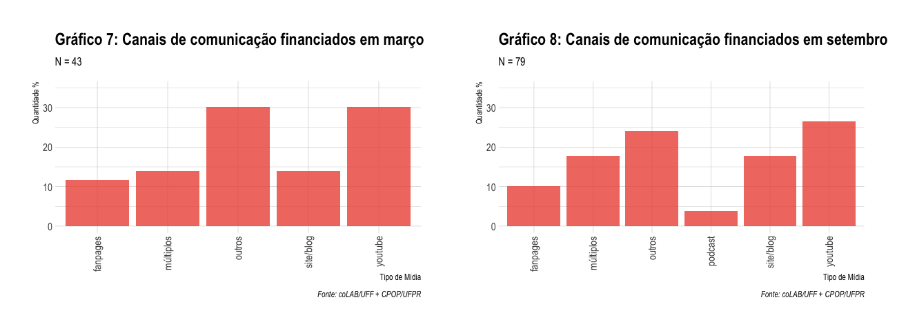
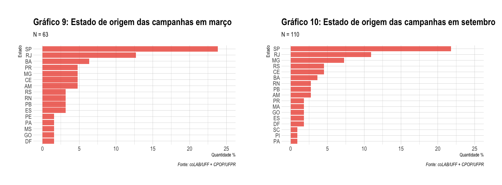

# data_crowdfunding

## Sumário
Scripts e dados utilizados para a construção do artigo "Tirando do bolso para financiar a rede bolsonarista...", apresentado por Viktor Chagas, Michele Massuchin e Natalia Dias, no 12º Encontro da ABCP.

Ver [http://colab-uff.github.io/](http://colab-uff.github.io/) para orientações de uso e referência dos dados.

## Coleta de dados
Os dados foram raspados da plataforma Apoia.se em março e setembro de 2020 a partir das palavras-chaves "direita" e "bolsonaro". O script em R modelou a base de dados e plotou os gráficos que integram este mesmo repositório. 

## Gráficos

